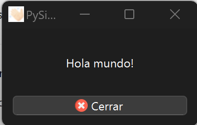

# holamundo-pyside6

Hola Mundo con PySide6.

Para ejecutar el *hola mundo*, necesitamos instalar Python3 y sus dependencias.

## 1. Clonar el Repositorio
```bash
git clone https://github.com/di-mcgrawhill/holamundo-pyside6.git
cd holamundo-pyside6
```

## 2. Instalación de Python3


Descarga Python para tu sistema operativo:

### Linux
Python3 viene preinstalado en la mayoría de distribuciones Linux, se puede comprobar si está instalado ejecutando la siguiente orden en una terminal:
```bash
$ python3 --version
```
De no estar instalada, se puede descargar desde [aquí](https://www.python.org/downloads/source/).

Para más información de como instalar, consultar la [documentación](https://docs.python.org/3/using/unix.html).


### Windows
Descargar el instalador haciendo clic [aquí](https://www.python.org/downloads/windows/) y seguir las instrucciones en pantalla.

Se dispone de más información sobre su instalación en el siguiente [enlace](https://docs.python.org/3/using/windows.html).


### macOS
Se dispone del binario ejecutable en el siguiente [enlace](https://www.python.org/downloads/macos/).

Se dispone de más información sobre su instalación en el siguiente [enlace](https://docs.python.org/3/using/mac.html).


## 3. Configuración del Entorno Virtual

Para crear un entorno virtual y poder aislar la ejecución del resto del sistema (sandbox), ejecutamos la siguiente instrucción en una terminal.

#### Windows
```powershell
# Crear entorno virtual
python -m venv venv

# Activar entorno virtual
.\venv\Scripts\activate
```

#### macOS y Linux
```bash
# Crear entorno virtual
python3 -m venv venv

# Activar entorno virtual
# macOS
source venv/bin/activate

# Linux
source venv/bin/activate
```

## 4. Instalar Dependencias

```bash
pip install -r requirements.txt
```

## 5. Ejecutar la Aplicación

```bash
python3 src/holamundo_pyside6/holamundo.py
```

Nos mostrará la aplicación holamundo_pyside6 en ejecución.





